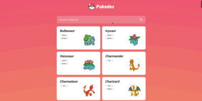

# API Pokedex

 Projeto destinado a criação de uma Pokedex (listagem de pokemons). Atividade realizada na plataforma Udemy.

 
 
 :test_tube: Proposta do projeto :nerd_face:

 
 
  

## :gear: Funcionalidades do projeto

- `Funcionalidade 1` `Retornar resultados gerados pela API Pokedex`: A primeira funcionalidade é receber pokemons da API do site PokéAPI.
- `Funcionalidade 2` `Realizar busca pelo pokemon desejado`: A segunda funcionalidade é retornar o pokemons digitado no campo de busca.
- `Funcionalidade 3 (Será Implementada)` `Criar um botão de paginação`: A terceira funcionalidade é criar um botão de "Carregar mais" para acrescentar 8 novos pokemons a lista em cada clique.

## :computer: Tecnologias usadas

- ``HTML5``
- ``CSS3``
- ``Angular``

## :open_file_folder: O que acha de acessar o projeto? 
Você pode acessar o projeto clicando [aqui](https://oscarlojr.github.io/pokedex/).
